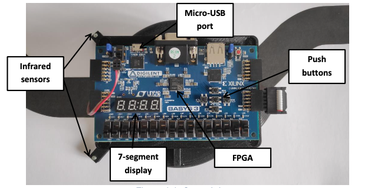

# autonomous_ground_drone

## Introduction
This project was done for the **EM433 Architecture, Design, and Synthesis of Hardware Systems** course of ISAE-SUPAERO's Embedded Systems Major. It consists in developing a path-following autonomous ground vehicle on an FPGA target.

A more detailed presentation of the project in the report_autonomous_ground_drone.pdf

## System HW presentation
This simple ground drone (see figure below), has 2 infrared sensors to detect a black line in a clear environment. The drone's movement is controlled by 2 motors at the rear: if the 2 motors have the same speed, then the drone moves straight forward, or it turns in the direction of the slower motor. The forward wheel is just a jockey wheel that allows free movement. The core of this drone is an xc7a35tcpg236-1 cpg236 Xilinx Artix-7 family FPGA. On the electronic board (a Basys3 demoboard from DIGILENT), there are some user-accessible I/Os, such as push buttons and 7-segment displays. The clock frequency of this system is 50MHz.

## Results

<video width="500" height="500" controls>
  <source src="img/ground_drone_video.mov" type="video/mp4">
</video>

